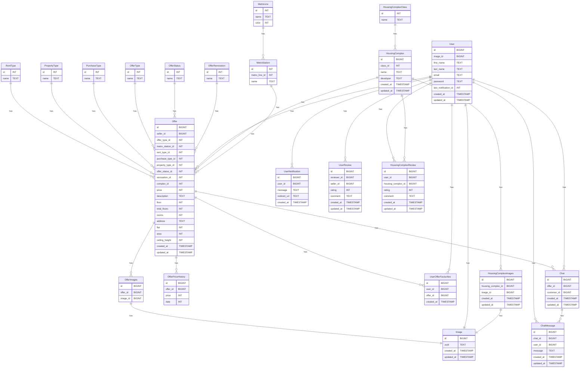

# ER диаграмма

# Таблицы БД
### 1. Таблица Offer
Содержит информацию о предложениях недвижимости.

### 2. Таблица OfferImages
Содержит информацию о изображениях предложений недвижимости.

### 3. Таблица OfferPriceHistory
Содержит информацию о истории цен предложений недвижимости.

### 4. Таблица RentType
Содержит информацию о типах аренды (посуточно, долгосрочно).

### 5. Таблица OfferType
Содержит информацию о типах предложений (продажа, аренда).

### 6. Таблица PropertyType
Содержит информацию о типах недвижимости (квартира, дом, апартаменты).

### 7. Таблица PurchaseType
Содержит информацию о типах недвижимости (новостройка, вторичное жилье).

### 8. Таблица OfferStatus
Содержит информацию о статусах предложений (активно, снято с продажи, черновик).

### 9. Таблица OfferRenovation
Содержит информацию о типах ремонта (без ремонта, косметический, евро).

### 10. Таблица MetroStation
Содержит информацию о станциях метро.

### 11. Таблица MetroLine
Содержит информацию о ветках метро.

### 12. Таблица User
Содержит информацию о пользователях.

### 13. Таблица Image
Содержит информацию о изображениях.

### 14. Таблица UserNotification
Содержит информацию о уведомлениях пользователей.

### 15. Таблица UserReview
Содержит информацию об отзывах о пользователях.

### 16. Таблица UserOfferFavourites
Содержит информацию о избранных предложениях пользователей.

### 17. Таблица Chat
Содержит информацию о чатах.

### 18. Таблица ChatMessage
Содержит информацию о сообщениях в чатах.

### 19. Таблица HousingComplex
Содержит информацию о жилых комплексах.

### 20. Таблица HousingComplexClass
Содержит информацию о классах жилых комплексов (комфорт, бизнес, элит, ...).

### 21. Таблица HousingComplexReview
Содержит информацию об отзывах о жилых комплексах.

### 22. Таблица HousingComplexImages
Содержит информацию о изображениях жилых комплексов.